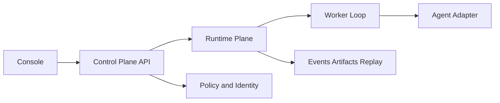

# DimooRun

DimooRun is an adapter-first runtime control plane for teams that already have
agent code and need a safer way to ship, operate, and inspect it.

It is built for the gap between "the agent works on my laptop" and "we can run,
govern, replay, and explain this in a real environment."

## Why Teams Use DimooRun

- Bring LangGraph, LangChain Agent, or DeepAgents code instead of rewriting
  business logic into a new platform.
- Publish versions, create deployments, and submit work through a runtime API
  and control plane instead of ad-hoc scripts.
- Inspect runs, attempts, events, artifacts, approvals, and audit evidence when
  something fails or needs review.
- Keep governance, model/tool/secret controls, and compatibility surfaces in
  the runtime layer instead of pushing them into app code.

Core boundary:

```text
Business logic is a black box.
Runtime behavior is a white box.
```

## First 15 Minutes

The fastest real path today is:

1. Start the local Compose stack.
2. Publish the `examples/langgraph/support-agent` example.
3. Create a deployment for that version.
4. Submit a task.
5. Watch the run complete from CLI and inspect it in Console.
6. Tear the stack down cleanly.

Working directory: repository root.

```bash
cp .env.example .env
docker compose up --build
```

Working directory: repository root.

```powershell
@'
from dimoorun import DimooRun

client = DimooRun(
    api_key="dev-local-key",
    base_url="http://127.0.0.1:8000",
    tenant_id=1,
    project_id=1,
)

manifest = {
    "schema_version": "1.0",
    "name": "support-agent",
    "version": "0.1.0",
    "runtime": {
        "framework": "langgraph",
        "adapter": "langgraph",
        "entrypoint": "agent:build_graph",
        "python": ">=3.11",
    },
    "capabilities": {
        "invoke": True,
        "stream": True,
        "checkpoint": True,
        "resume": True,
        "interrupt": True,
        "human_in_loop": True,
        "tool_events": True,
        "model_events": True,
        "token_usage": True,
        "filesystem": False,
        "subagents": False,
    },
}

validation = client.validate_package(
    package_uri="file:///workspace/examples/langgraph/support-agent",
    framework="langgraph",
    adapter="langgraph",
    entrypoint="agent:build_graph",
    manifest=manifest,
)
agent = client.create_agent(name="support-agent", description="README quickstart")
version = client.create_agent_version(
    agent_id=agent["id"],
    version="0.1.0",
    package_uri="file:///workspace/examples/langgraph/support-agent",
    framework="langgraph",
    adapter="langgraph",
    entrypoint="agent:build_graph",
    manifest=manifest | {"validation_token": validation["validation_token"]},
    capabilities=manifest["capabilities"],
    status="ready",
)
deployment = client.create_deployment(
    agent_id=agent["id"],
    agent_version_id=version["id"],
    environment="local",
    desired_status="active",
)
run = client.submit_deployment_task(
    deployment_id=deployment["id"],
    input={"message": "customer refund request for order 42"},
    thread_id="readme-quickstart",
)

print(f"agent_id={agent['id']}")
print(f"version_id={version['id']}")
print(f"deployment_id={deployment['id']}")
print(f"run_id={run['run_id']}")
client.close()
'@ | uv run python -
```

Working directory: repository root.

```bash
uv run dimoorun run watch --base-url http://127.0.0.1:8000 --api-key dev-local-key --tenant-id 1 --project-id 1 --run-id <RUN_ID> --show-events
```

Working directory: repository root.

```bash
docker compose down --remove-orphans --volumes
```

The full evaluator walkthrough, Console checkpoints, and expected results are in
[docs/start/quickstart.md](docs/start/quickstart.md).

## Core Workflows

- Agent package validation, version registration, and readiness checks
- Deployment activation, pause, resume, drain, restart, and rollback
- Task submission, run inspection, retry, replay, and failure triage
- Human approval, policy enforcement, model/tool/secret governance
- Runtime evidence review across events, artifacts, traces, and audit records

## Architecture Signal

DimooRun keeps separate product planes so runtime control does not leak into
agent business logic:



More detailed diagrams for control plane, runtime plane, worker loop,
governance, compatibility, and observability live in
[docs/architecture/overview.md](docs/architecture/overview.md).

## Screenshot Evidence

Generated product evidence is indexed in
[docs/readiness/evidence-gallery.md](docs/readiness/evidence-gallery.md).
Hosted/public screenshots are still incomplete unless the gallery row links to a
current artifact.

- Readiness status: [docs/readiness/scorecard.md](docs/readiness/scorecard.md).

## Supported Modes

- Native runtime APIs for agents, versions, deployments, tasks, runs, replay,
  metrics, governance, and admin surfaces
- Console operator workflow for deployments, runs, tasks, approvals, settings,
  identity, observability, and enterprise ops
- CLI workflow for package validation, agent publish, deployment task submit,
  replay, and run watch
- Python and TypeScript SDK surfaces for the same runtime path
- Compatibility path for LangGraph ecosystem-style integration without bypassing
  native governance

## Current Maturity

DimooRun has a production-shaped foundation, not a completed production-grade
product.

Use the same shorthand as the readiness scorecard:

```text
Production-shaped foundation: yes.
External production-grade platform: not yet.
```

- Strong today: adapter-first runtime model, durable worker/task foundations,
  deployment control, policy/governance surfaces, runtime observability, Console
  live backend, CLI/SDK workflow, Compose/Helm assets, and local proof for cost,
  scheduled/batch, and catalog workflows.
- Still incomplete: broad screenshot evidence, clean hosted smoke proof, some
  operator workflows, release proof, and externally hosted trust verification.

Use these before making any maturity claim:

- [Current Maturity](docs/readiness/current-maturity.md)
- [Production Readiness Scorecard](docs/readiness/scorecard.md)
- [Docs Home](docs/README.md)

## What DimooRun Is Not

DimooRun is not:

- a low-code agent builder
- a drag-and-drop workflow canvas
- a prompt IDE
- a business app generator
- a replacement for your agent framework
- a guarantee that arbitrary agent code becomes safe to ship to production once
  it is imported

## Documentation Map

- [Docs Home](docs/README.md)
- [Product Overview](docs/start/product-overview.md)
- [Getting Started](docs/start/getting-started.md)
- [Quickstart](docs/start/quickstart.md)
- [Concepts](docs/reference/concepts.md)
- [Architecture Overview](docs/architecture/overview.md)

## Local Verification

Working directory: repository root.

```bash
uv run pytest -q
uv run ruff check apps tests packages/sdk-python scripts migrations
uv run mypy apps/server tests packages/sdk-python scripts
```
