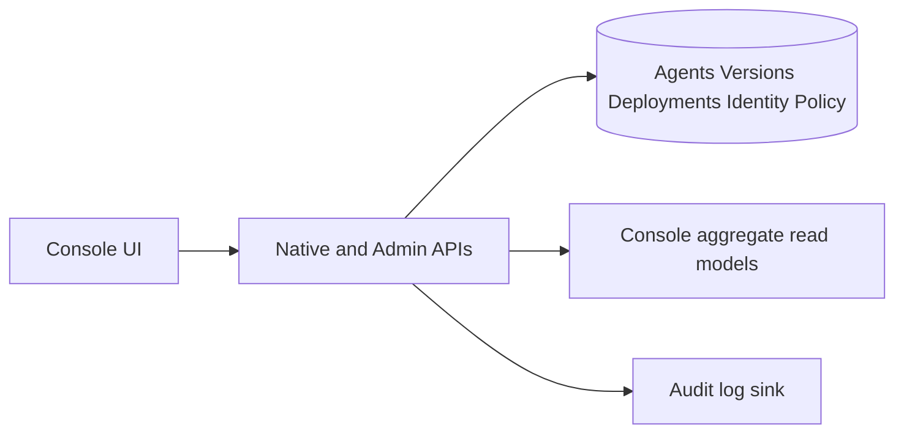
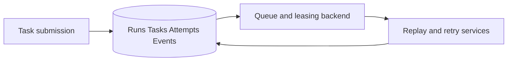
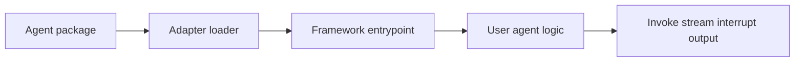
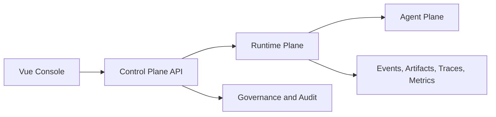
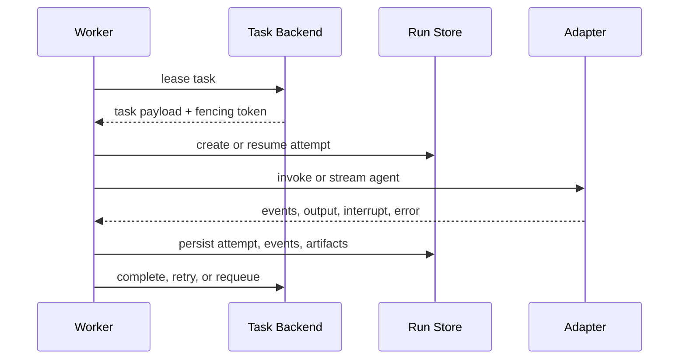
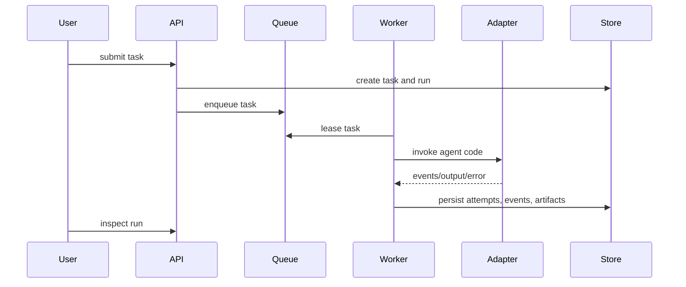
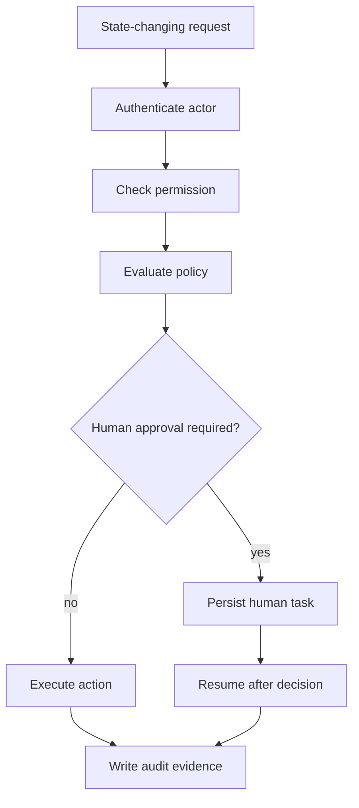
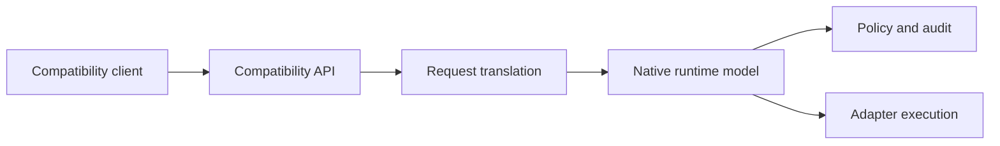
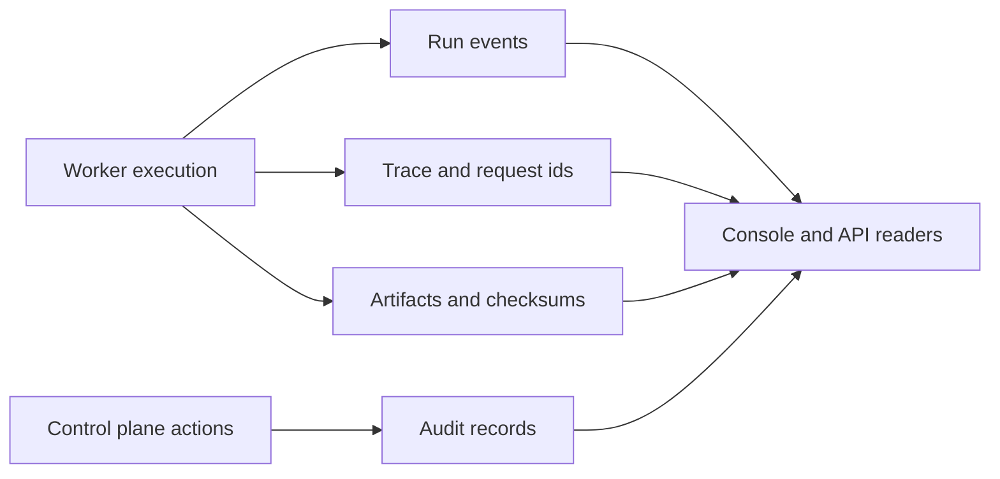

# Architecture

## Control Plane

The control plane owns metadata, identity, policy, admin routes, and Console
aggregates.

## Runtime Plane

The runtime plane owns task lifecycle, retries, replay, cancellation, and the
durable evidence model around execution.

## Agent Plane

The agent plane is where user code runs. DimooRun should wrap it, not replace
it.

## Planes

- Control Plane: APIs, package/version/deployment metadata, governance, identity, admin resources, and Console aggregates.
- Runtime Plane: task submission, leases, attempts, runs, events, replay, cancellation, retries, and worker coordination.
- Agent Plane: adapter-loaded user agent code and framework compatibility boundaries.
- Console: operator workflows backed by typed APIs and aggregate read models.

## Worker Loop

## Runtime Flow

## Governance Decision Path

High-risk actions should show disabled reasons, required permissions, policy
warnings, audit requirements, impact preview, and rollback guidance before
submit.

## Compatibility Path

Compatibility APIs and adapters let users bring LangGraph, LangChain Agent, and
DeepAgents code without bypassing native governance. Unsupported capabilities
must be reported as gaps, not hidden behind optimistic claims.

## Observability Path

Runtime observability separates events, traces, artifacts, metrics, and audit
records. The target is queryable, redacted evidence that helps operators
classify failures, replay safely, and explain decisions.

