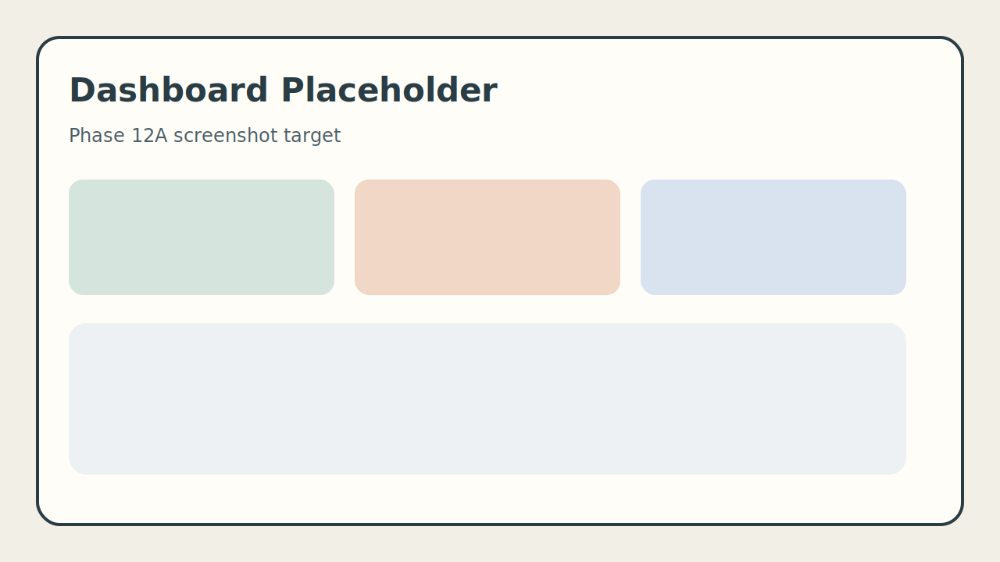
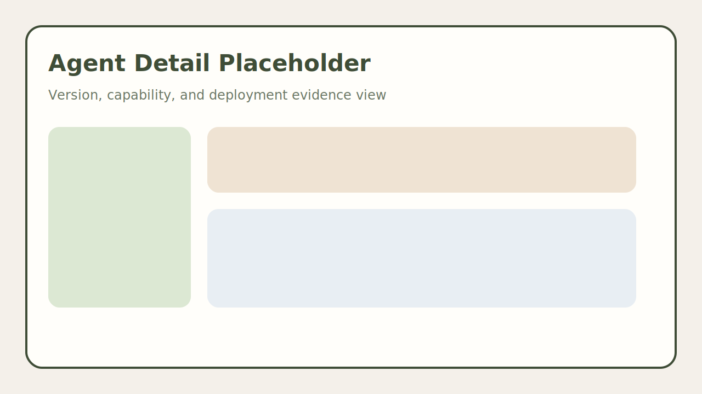
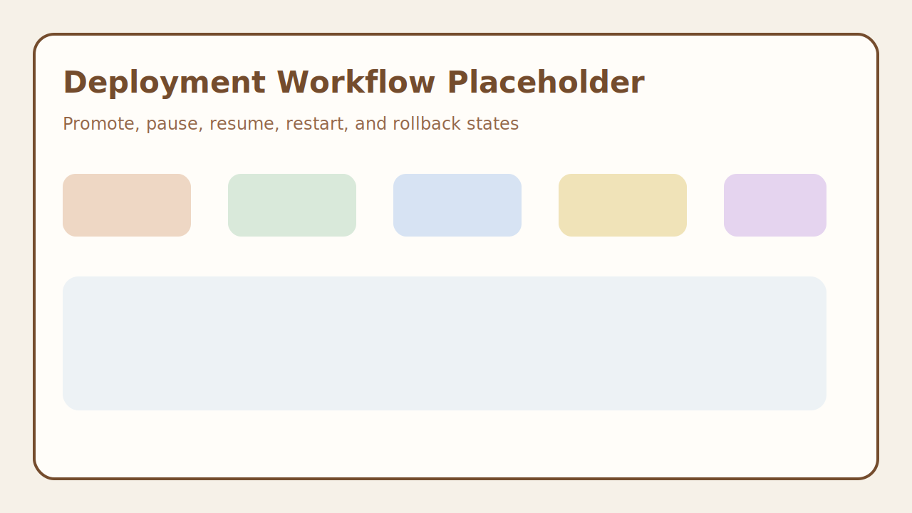
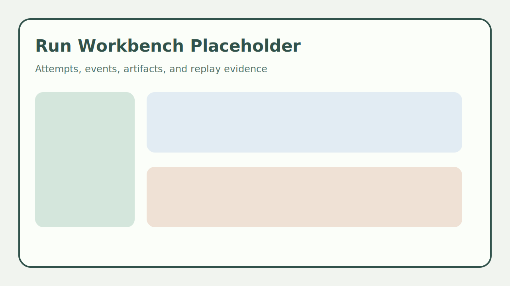
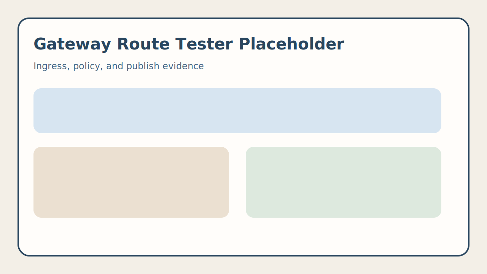
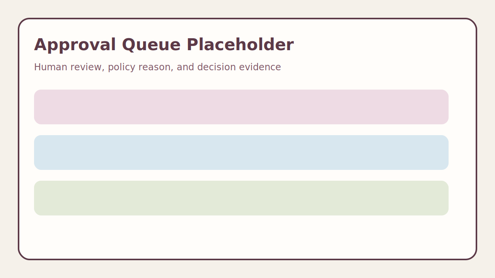
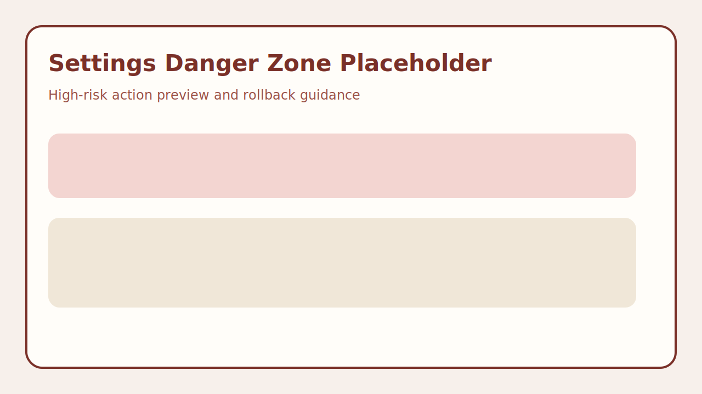
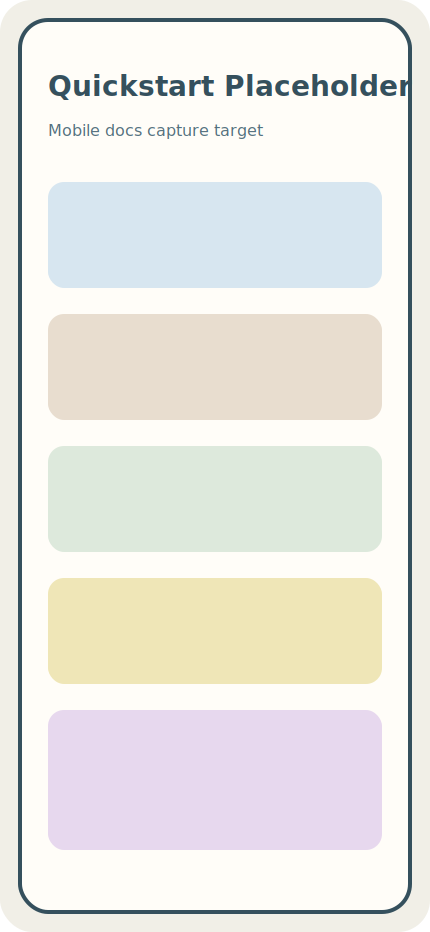

# Screenshots

## Required Screenshots

The gap closure plan requires desktop and mobile screenshots for:

- dashboard;
- agent detail;
- deployment workflow;
- run workbench;
- gateway route tester;
- approval queue;
- settings danger zone;
- docs quickstart path.

Screenshots should be generated from real browser flows, preferably through
Playwright, and linked back to the workflow evidence they represent.

## Placeholder Gallery

The following placeholder assets exist so README and docs can link to stable
targets before the capture pipeline is complete:

| Workflow | Placeholder |
|---|---|
| Dashboard |  |
| Agent detail |  |
| Deployment workflow |  |
| Run workbench |  |
| Gateway route tester |  |
| Approval queue |  |
| Settings danger zone |  |
| Docs quickstart mobile |  |

## Current State

Screenshot evidence is not complete. This document is a truthful Phase 12A
placeholder and must not be used as proof of polished Console workflows until
image files and Playwright generation evidence are added.

## Evidence Rules

- Do not use screenshots that depend on mock-only capabilities unless labeled as demo mode.
- Include viewport, route, test command, and data fixture or backend state.
- Pair screenshots with accessibility and responsive checks where the workflow is marked complete.

